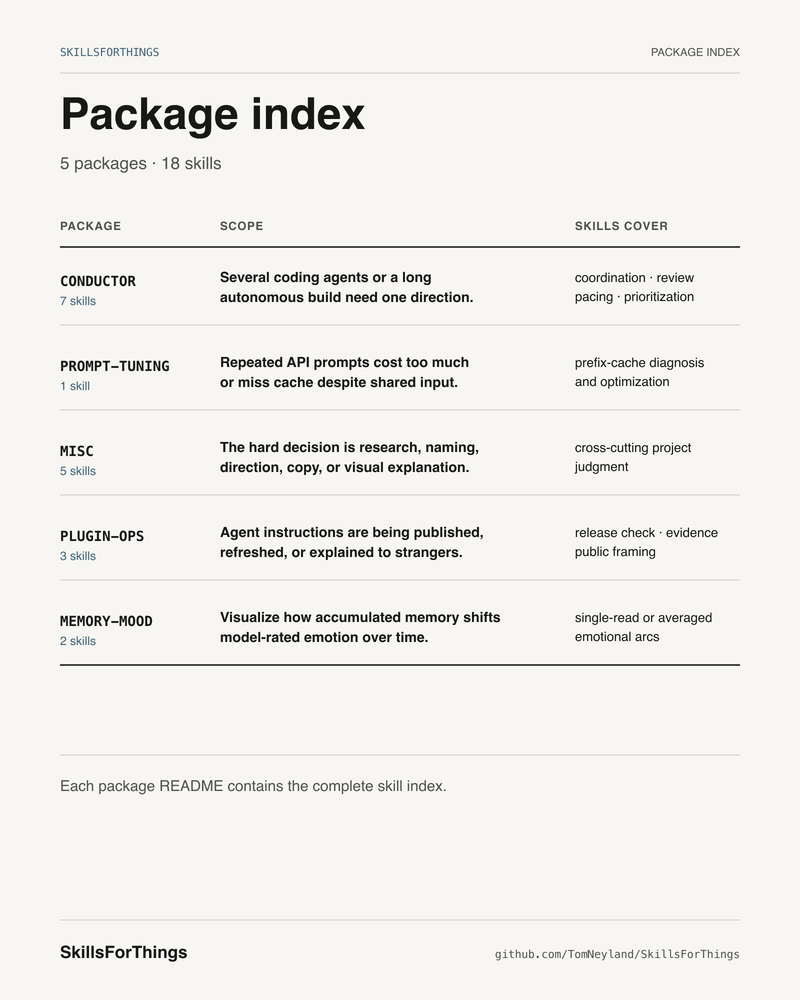

# SkillsForThings



A Claude Code skill marketplace for multi-agent builds, prompt engineering, research, plugin maintenance, and memory visualization.

## Install

In Claude Code:

```
/plugin marketplace add TomNeyland/SkillsForThings
/plugin install conductor@SkillsForThings
```

Or from a local clone:

```bash
claude plugin marketplace add /path/to/SkillsForThings
claude plugin install conductor@SkillsForThings
```

## Plugins

### `conductor`

Coordinate a fleet of subagents to do what one context can't — delegate owned units, review with a dual-model critic, trace the seams, integrate. Ships five ready-to-delegate subagents (`implementer`, `correctness-reviewer`, `integration-gap-auditor`, `scout`, `design-steward`).

| Skill | Use when |
|---|---|
| `coordinate-agents` | A task is large enough to split across multiple subagents you coordinate as the lead, rather than doing it all in one context |
| `fan-and-critic` | One pass isn't enough to trust a result — you need parallel breadth (options, perspectives, coverage), an adversarial check of an artifact before you act, or both |
| `autonomous-build` | Explicitly kicking off a long, autonomous product-building session by name |
| `autonomous-build-purpose-layers` | Deciding what to build next in a long session — advancing the product's arc of purpose, not polishing the last view |
| `autonomous-build-jealousy-ranking` | Ranking a backlog or filing issues — tool-vs-toy, red-team, kill-and-replace |
| `autonomous-build-session-pacing` | Running a long autonomous window — heartbeat, commit/push cadence, typecheck-before-commit, budget triage |
| `autonomous-build-commit-essays` | Writing a commit message that captures the WHY — audience and arc-position, not just what changed |

### `prompt-tuning`

Skills for optimizing LLM prompts across multiple axes — cache hit rate, latency, cost, structure.

| Skill | Use when |
|---|---|
| `openai-prompt-cache` | Designing or auditing OpenAI API prompts for cache hit rate; debugging cost spikes; building systems with large reused prefixes (RAG pipelines, agent loops, structured extraction, batch jobs) |

More skills are planned (`recency-reiteration`, `schema-vs-grammar`, others).

### `plugin-ops`

Skills for maintaining the marketplace itself — refreshing stale claims, validating manifests, auditing skills against current evidence.

| Skill | Use when |
|---|---|
| `refresh-skill` | A skill's content or references may have gone stale; a new SDK / model / API release may have invalidated specific recommendations; validating that measurements and version-pinned claims are still accurate |
| `admitting-a-skill` | A new or edited skill is about to enter a public marketplace, especially one ported or genericized from a private codebase — mechanical lint + a dual-model origin-leak and quality gate |
| `framing-skill-infographics` | Deciding which reader benefit, mechanism, proof, hook, and details belong in a shareable infographic for a skill in this marketplace |

### `memory-mood`

Replays the memory files your assistant has formed — one at a time, in formation order — and after each asks the plainest question, *how do you feel?* Renders a self-contained HTML page: an emotional-arc chart (valence, arousal, eight named feelings) plus a timestamped "tweet feed" of how it felt as each memory landed.

| Skill | Use when |
|---|---|
| `memory-mood` | Visualizing the mood/emotional arc of your assistant's accumulating memories; free-tier (Sonnet subagents, one reading per timepoint, no API key, stdlib only) |
| `memory-mood-openai` | Same, but high-fidelity via the OpenAI API — k samples per timepoint averaged with ±1σ confidence bands (requires `OPENAI_API_KEY`) |

### `misc`

Assorted process skills that don't fit an existing plugin family.

| Skill | Use when |
|---|---|
| `prior-art` | Before building a custom identifier scheme, data model, algorithm, file format, or taxonomy; noticing you're about to hand-roll something that feels like a solved problem; starting work in an unfamiliar domain |
| `align-terminology` | Reviewing or designing schema field / model / enum names, or auditing names against authoritative terminology |
| `cutting-internal-leaks-from-copy` | Reviewing or writing customer-facing prose an LLM produced, to catch material that leaks the machine's internals, the build process, the author's hedging, or copy narrating its own device |
| `orchestrating-greenfield-builds` | A user brings a product idea for a long autonomous multi-agent build session (greenfield or rebuilding a mediocre predecessor) with a showcase-grade quality bar; a build spans many sessions and future agents must inherit intent; a predecessor codebase tempts you to inherit its stack, fixes, or roadmap |
| `creating-technical-infographics` | Turning technical explanations, workflows, failures, comparisons, or instructions into plain, editable 4:5 SVG and PNG infographics for mobile feeds |

See `CLAUDE.md` for contribution conventions.

## License

MIT (TBD — currently unlicensed pending decision).
