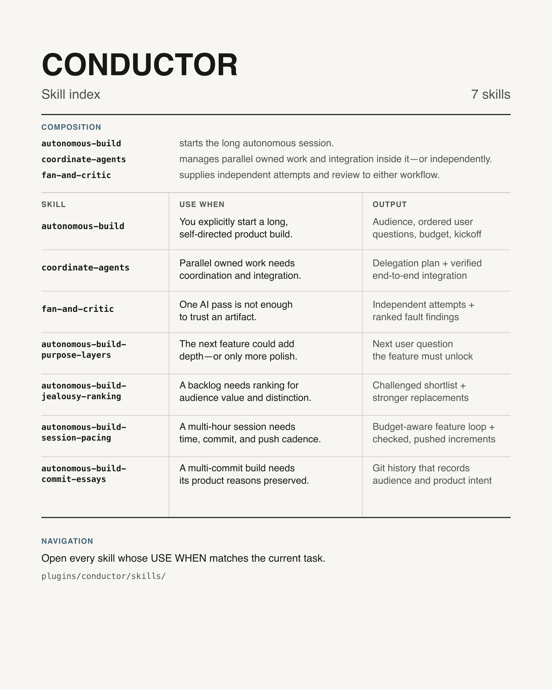

# Conductor

Skill index for coordinated AI-assisted software builds. `autonomous-build` is the long-session entrypoint; `coordinate-agents` manages parallel owned work and integration inside that session or independently; `fan-and-critic` supplies independent review to either. Open every skill whose **USE WHEN** entry matches the current task.
