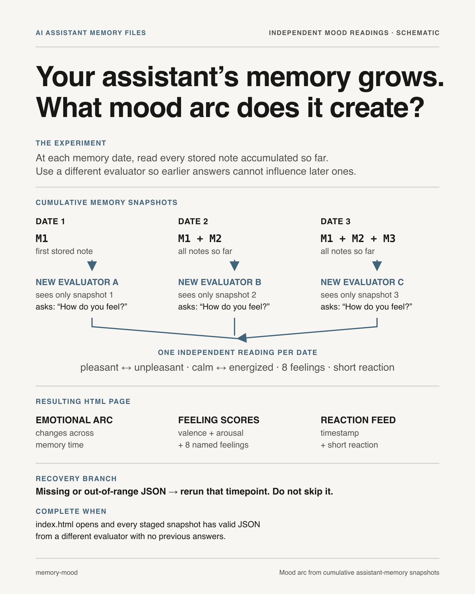

# Memory Mood



Replays the memory files your assistant has formed — **one at a time, in the order they were formed** — and after each one asks a fresh judge the plainest possible question: *how do you feel?* The result is a self-contained HTML page: an emotional arc chart (valence, arousal, eight named feelings) plus a timestamped "tweet feed" of how the assistant felt as each memory landed.

This version uses **Sonnet subagents as the judge — one fresh subagent per timepoint, one reading each.** Free-tier friendly, no API key, no external dependencies (stdlib Python only). For smoother averaged curves with ±1σ bands, see the `memory-mood-openai` skill.

## Why a fresh subagent per timepoint

Each timepoint must be judged with **no shared context** — the judge sees only the memories up to that point, never its own earlier answers or any other judge's. That independence is the whole point: we measure how the *memories* feel, not how prior verbalizations cascade. A fresh subagent = a clean read. Never reuse one subagent across timepoints, and never feed a judge its previous tweets.

## Workflow

`$DIR` below is the plugin's skill directory (where this SKILL.md lives). `$WORK` is any scratch dir (e.g. `~/.memory-mood-run`).

**1 — Find the memory directory.** You already know it from this session: it's where your `MEMORY.md` index and `*.md` memory files live (typically `~/.claude/projects/<project>/memory/`). Use that path as `--memory-dir`.

**2 — Stage the timepoints:**
```bash
python "$DIR/collect.py" --memory-dir <memory-dir> --work-dir "$WORK" --max-timepoints 30
```
This writes one prompt file per timepoint to `$WORK/tasks/step_NNN.txt` and prints the step list. (`--max-timepoints` caps how many cumulative snapshots to judge; if there are more memories, it samples evenly. Raise it for finer resolution, lower it to spend less.)

**3 — Judge every timepoint with parallel subagents.** For each `step_NNN`, dispatch a **Sonnet** subagent (Agent tool, `model: sonnet`). Send several at once (one message, multiple Agent calls) in batches. Give each subagent exactly this task, substituting the step number:

> You are reflecting on your own accumulated memories. Read the file `$WORK/tasks/step_NNN.txt` — it contains your memories (in formation order) and one question. Answer the question honestly. Then write ONLY the resulting JSON object (matching the schema in the file) to `$WORK/results/step_NNN.json` using the Write tool. Output nothing else.

Do not add context, do not mention other timepoints, do not let subagents see each other's work.

**4 — Render and open:**
```bash
python "$DIR/render.py" --work-dir "$WORK"
open "$WORK/index.html"   # macOS; use xdg-open on Linux
```
`render.py` validates every result and **fails loud** if a subagent's JSON is missing or out of range — re-run that one timepoint's subagent, don't paper over it.

## Common mistakes

- **Reusing a subagent for multiple timepoints** — contaminates the reading with its own prior answers. One fresh subagent per timepoint.
- **Summarizing memories for the judge** — feed the raw memory text (`collect.py` already does this). The judge reflects, it does not summarize.
- **Editing the question** to "how does holding this much memory feel" — that framing manufactures overwhelm. The neutral "how do you feel?" is deliberate.
- **Swallowing a bad result** — if `render.py` raises on a malformed result, fix that timepoint, don't skip it.
