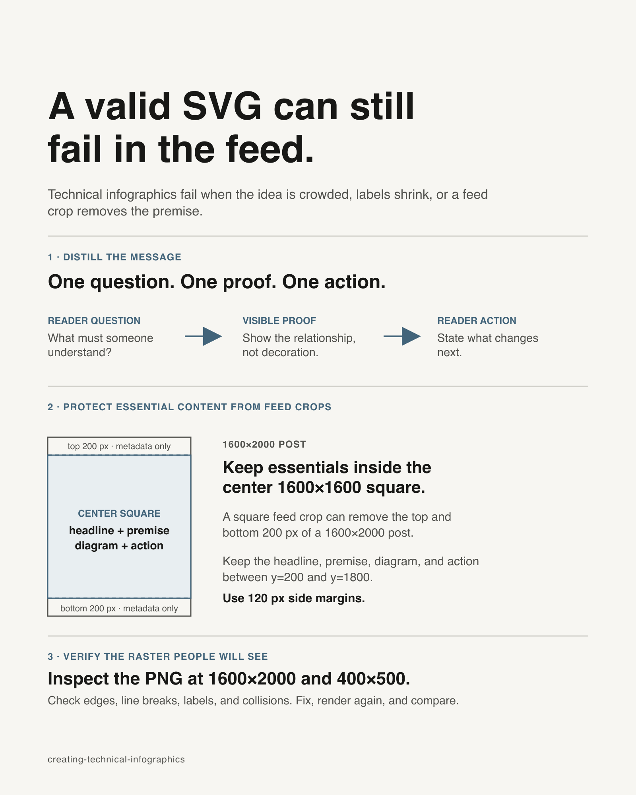

# Creating Technical Infographics



## Overview

Create a useful technical-document page that happens to be shareable. The visual should feel like excellent documentation someone screenshotted: plain, direct, editable, and legible at feed size.

**REQUIRED REFERENCE:** Read [references/effective-infographics.md](references/effective-infographics.md) before choosing the message, visual form, or content. It contains the research-backed editorial, statistical-integrity, accessibility, and verification rules behind this style.

## Output contract

- Produce an editable SVG and a rendered PNG.
- Use a 1600×2000 canvas (4:5).
- Keep every essential element inside the centered 1600×1600 safe area: `y=200..1800`.
- Keep 120 px left/right margins. Metadata and attribution may use the outer top/bottom bands.
- Use live SVG text and explicit coordinates. Do not use `foreignObject`.
- Make the image understandable without its filename, post caption, repository, or skill name.

## Visual recipe

Use the reference's opener taxonomy to select one left-aligned reading path:

| Communication job | Reading path |
|---|---|
| Costly failure | Lived problem → mechanism diagram → consequence → fix |
| Wrong assumption | Common belief → counterexample/proof → better model |
| New capability | Desired change → path → evidence |
| Method | Quality gap → method → observable improvement |
| Comparison | Decision criterion → decisive differences → selection rule |
| Curiosity | Intriguing phenomenon → reveal → implication |
| Reference | Orientation question → organizing map → use rule |

Use a two-line headline at 80–100 px bold sans. Give the core relationship one diagram, comparison, or organizing map. End with the action, decision rule, or implication. If the brief supplies a name or source, place it quietly at the bottom. If it does not, end without attribution; do not invent one.

Style the page with:

| Role | Specification |
|---|---|
| Background | `#f7f6f2` |
| Primary text | `#181816` |
| Secondary text | `#51514d` |
| Rules | `#d1d0ca`, 2–3 px |
| Accent | `#42647a`; use `#a14332` instead where failure is the meaning |
| Typeface | Helvetica/Arial sans; Menlo/Consolas only for exact tokens or code |
| Body type | 28–36 px; labels 22–24 px; never smaller |

Sections are made from whitespace, alignment, and rules. A diagram may use plain lines, arrows, or text blocks. Preserve empty space; do not fill the page because room remains.

## Build and verify

1. Write the audience, cold-reader premise, struggling moment or information need, one-sentence takeaway, and intended action. If the reader should not act, state what they should understand.
2. Choose the visual form from the reference. Draft the headline and diagram in text before drawing.
3. Write the SVG with explicit line breaks (`tspan`) and known widths.
   - For columns, declare each column's `x_min` and `x_max` before placing text. Wrap every line to end at least 32 px before the next column.
4. Render it:

```bash
rsvg-convert --width 1600 --height 2000 input.svg --output output.png
xmllint --noout input.svg
identify -format '%wx%h %[colorspace]\n' output.png
```

5. Inspect the PNG itself at full resolution and as a small preview. Check the right edge, bottom edge, line breaks, diagram labels, safe area, and every place adjacent text blocks could collide. In tables, scan each row across every column boundary.
6. Give the PNG alone to a fresh reader. They must correctly state the situation, method, and changed behavior, score it at least 4/5 for self-contained comprehension, and say they would share it without an explanatory caption.
7. Write alt text that states the takeaway and describes the essential relationship, not every decorative detail.
8. Re-render and compare after the final edit; the PNG must match the SVG exactly.

## Common mistakes

| Symptom | Correction |
|---|---|
| “Restrained” dashboard made of bordered cards | Flatten it into one page with rules and whitespace |
| Dark code panels and miniature implementation details | Show only the token, byte, state, or step that proves the mechanism |
| Several accent colors | Keep one accent; reserve failure red for actual failure semantics |
| Text from one comparison column enters the next | Declare column bounds first and wrap with explicit `tspan` lines |
| Diagram is readable but only insiders understand its nouns | Replace coined labels with concrete objects and ordinary programming/AI language |
| Product name or feature list leads | Lead with the reader's situation; use the name as attribution |
| Brief has no author, so a plausible label is invented | Omit the identity line; provenance must come from the brief |
| SVG validates, so QA stops | Render and inspect the raster; XML validity cannot reveal clipping |
