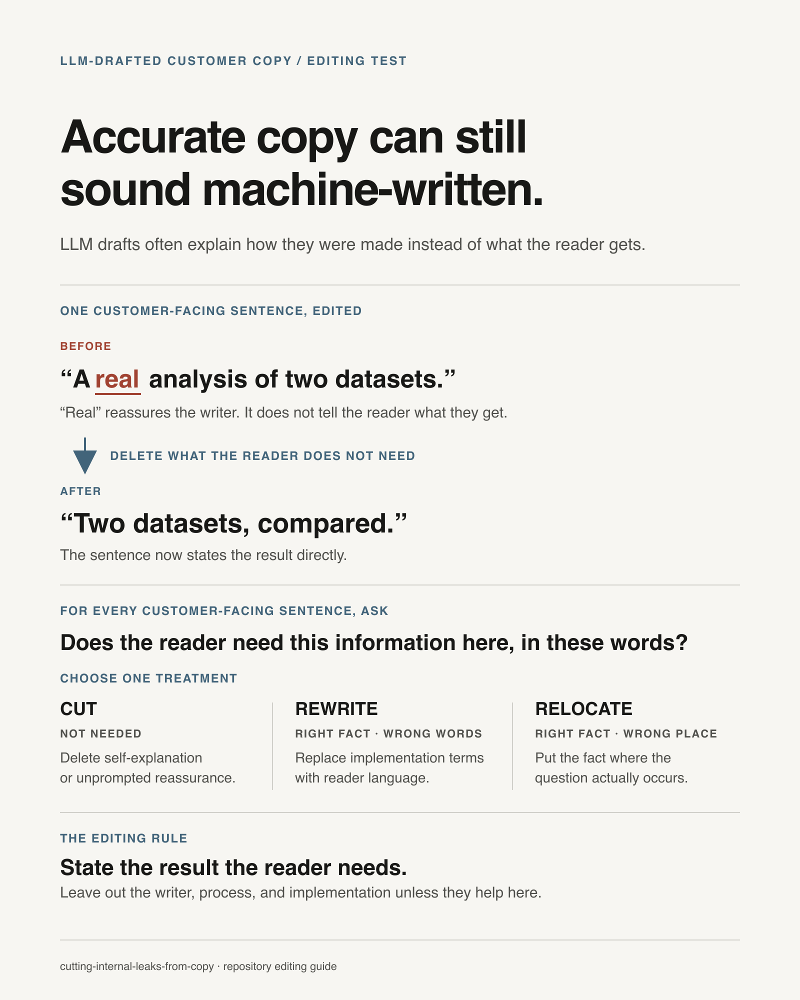

# Cutting Internal Leaks From Copy

## Overview

Every category of tell in LLM-authored copy is the same defect wearing different
clothes: **backstage material reaching the audience.** The machine's plumbing,
the build process, the author's private doubts, and the copy admiring its own
honesty are all *internal*. None of it is for the reader. It leaks in because the
model writes from inside the system it's describing instead of from the reader's
side of the screen.

**The one test, applied to every sentence:** does this exist to serve the
reader's next action, or does it leak the author's / machine's internal world? If
it's the system explaining itself, the author reassuring themselves, the copy
narrating its own structure, or a hedge against a doubt the reader doesn't have
yet — cut it or move it.

This is an editing pass, not a style preference. The reader loses trust the
instant the seam shows.

## The eight leak classes

| Class | The leak | Tells (greppable + not) | Fix |
|---|---|---|---|
| **Machinery** | Implementation vocabulary reaches the reader | `pipeline`, `offsets`, `fixture`, `golden`, `in-browser`, raw field names (`is_flagged`, `retry_count`), stage codes (`step_2_normalize`), internal component or subsystem names ("the ingester", "the worker"), "auto-transcribed" | Say what the reader would say, or drop it. Name the product, not its parts. Domain vocabulary the reader owns is fine; plumbing is not. |
| **Fourth wall / making-of** | Prose references the building of the thing, or the author | "a real X", "not a screenshot", "real components", founder decisions, issue/ticket numbers, "we curated / wired / composed" | Delete the framing; state the fact. "A real analysis of two datasets" → "Two datasets, compared." The word *real* is usually the author reassuring themselves. |
| **Device narration** | Copy describes its own structure or intent instead of talking to the reader | "the fine print, up front", "here's the TL;DR", "no fluff, just...", "let's be honest", a section label used as its headline | Replace with a headline about the reader's decision or the content itself. |
| **Failure-forward** | Raising and answering a doubt the reader didn't have, before they'd have it | "what if it fails", "don't worry, it's refunded", pre-apology, "no need to be concerned" | Remove it — do not reframe it (see below). If the info is real, move it to the surface where the reader actually has the doubt (the transaction/confirmation screen), never before. |
| **Condescension** | Explaining the reader's own domain tools back to them | narrating what a p-value / a git rebase / a load balancer *is* to an expert audience | Cut the explanation; say only what's new or theirs to decide. |
| **Correction scar** | The artifact records the flaw it just fixed, instead of just being fixed | a code comment quoting the reviewer or justifying the change ("reviewer: too casual", "not a workaround", "changed from X because..."), copy that defends against the exact objection just raised, a doc line "note: this is NOT X" | Make the change as if it were always so. The clean version keeps no memory of the wrong one. The *why* lives in the commit / PR / conversation, never in the artifact. |
| **Quiet part out loud** | Copy narrates the persuasion it is running — it instructs the reader to perform the mental move the design should make them perform on their own | "price it against that", "just imagine the time you'll save", "ask yourself what that's worth", "think about what it costs you today" | Engineer the move so the reader arrives at it themselves. Show the anchor (the per-unit price, the hours) and stop; the instruction to apply it is what makes them feel handled. Note: strong critics miss this one — it reads as "confident" copy. It is not a jargon or rhythm tell, it is an intent tell, so it survives every leak sweep that hunts words. |
| **Style signature** | The mechanical LLM rhythm | em-dashes in prose, tricolons everywhere, "not just X but Y", "it's not about A, it's about B", stacked hedges ("generally", "typically", "often") | Rewrite in the surrounding human voice. One idea per sentence; vary the rhythm. |

## Reframing a failure-forward leak does not fix it

The subtle one. When you find "what if it fails, you're refunded," the instinct
is to soften it to a positive ("you pay only for what we deliver"). **That still
plants the doubt** — the reader wasn't worried until the copy raised it.
Reassurance *creates* the concern it answers. The fix is to remove it, or relocate
it to where the doubt genuinely lives (a purchase page, a confirmation step). Same
logic applies to any pre-emptive objection-handling: if no reader voiced it,
don't answer it in prime real estate.

## Correction scars: fix it, don't memorialize it

This one fires right after a human corrects you, and it is the hardest to feel
from the inside. You make the change — but you also inscribe the correction into
the artifact: a code comment that names the old flaw or quotes the feedback, a
copy line that now defends against the exact objection just raised, a doc
sentence that says "this is NOT X" because someone once thought it was. Even
without writing "I fixed this," you have made the artifact carry a memory of
being wrong.

Two urges drive it: proving to the human that you heard them, and warning the
future against regressing. Both put *your* process into *their* artifact. The
reader or the next code-reader inherits your defensiveness and has to wonder what
went wrong here — a question that only exists because the scar answered it.

The clean version keeps no memory of the wrong one. After any correction, re-read
what you touched and ask: **would this comment or sentence exist if the flaw had
never happened?** If it exists only to mark the fixed flaw, cut it. The change
itself is the fix. The reason for the change belongs in the commit message, the
PR description, or the conversation — the three places built to hold "why we
changed it" — never in the code comment or the reader-facing text. (A comment
earns its place only when it states a live constraint the code cannot show, not
when it narrates the edit's history.)

## The detection procedure

1. **Grep the greppable tells first** — em-dashes (`—`), and the machinery tokens
   for this project (`pipeline`, `fixture`, `offset`, raw field/flag names,
   component names, "in-browser"), plus "real/really", "fine print", "TL;DR",
   and failure words (`refund`, `fails`, `attempt`) on pre-transaction surfaces.
2. **Then read every reader-visible string end to end.** The worst leaks —
   device narration and condescension — contain no keyword and grep will never
   find them. Read them aloud; the seam is audible.
3. **Include the non-obvious surfaces.** Reader-visible ≠ body prose. Sweep chart
   legends, tooltips, `aria-label`/alt text, placeholders, empty states, error
   messages, meta descriptions, and any app components embedded on a marketing
   page. These are a common blind spot precisely because they feel like "code."
4. **Apply the test question to each sentence.** Cut, rewrite to reader-language,
   or relocate.
5. **Distinguish wrong from misplaced.** Some leaked material (billing mechanics,
   a caveat) isn't false — it's in the wrong place. Move it to where the reader
   needs it instead of deleting the fact.

## What is NOT a leak (don't over-correct)

- Domain vocabulary the reader already owns (for a stats tool: regression, confidence
  interval, p-value; for a dev tool: rebase, mutex). That's their language, not plumbing.
- A caveat or mechanic on the surface where the reader genuinely needs it (the
  cost on the confirmation screen; the privacy note on the upload dialog).
- A single em-dash a human author deliberately uses — the target is the *pattern*
  and the machine-default reach for it, not the glyph in isolation.
- Faithful data (a fixture's real values, a quoted source). Fix the *rendering*
  of internal-sounding data, never the data itself.

## Going thorough: two independent hunters

For a high-stakes surface, run two reviewers (ideally different models) over the
*same* brief and reconcile. Agreement is high-confidence; disagreement is the
signal to adjudicate by reading the actual string and the audience. This catches
the classes one reviewer is blind to, and surfaces the borderline calls that
need a human ruling.

## Common rationalizations

| Thought | Reality |
|---|---|
| "It's technically accurate." | Accuracy isn't the bar. Machinery is accurate *and* a leak. |
| "I'll reframe it to sound positive." | For failure-forward copy, reframing still plants the doubt. Remove or relocate. |
| "The reader might wonder about this." | If they didn't voice it, answering it in prime real estate creates the worry. |
| "This explains what the feature does." | If it explains the reader's own tools, it condescends. Say only what's new. |
| "Grep found nothing, so it's clean." | The worst leaks (device narration, condescension) have no keyword. Read it all. |
| "It's just one em-dash." | The tell is the pattern and the default reach. Match the human voice around it. |
| "I'll leave a note so it isn't reintroduced." | That's what the test, the commit message, and the review are for. The comment just scars the code. |
| "The comment shows I understood the correction." | The human wants the fix, not proof you heard them. Understanding shows in the clean change. |
| "I'm just helping them see the value." | If they must be told to compare, the comparison isn't landing. Show the number and trust them to it. |
