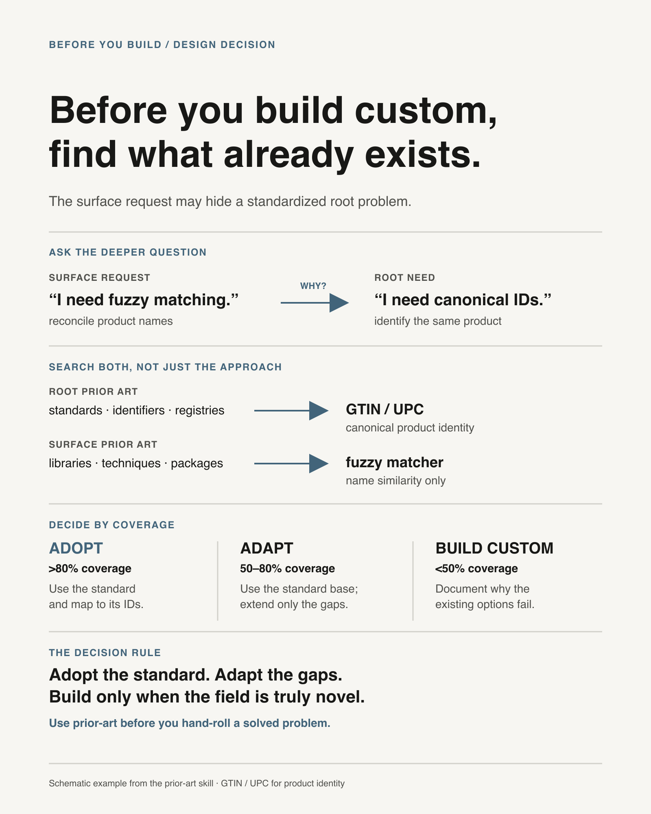
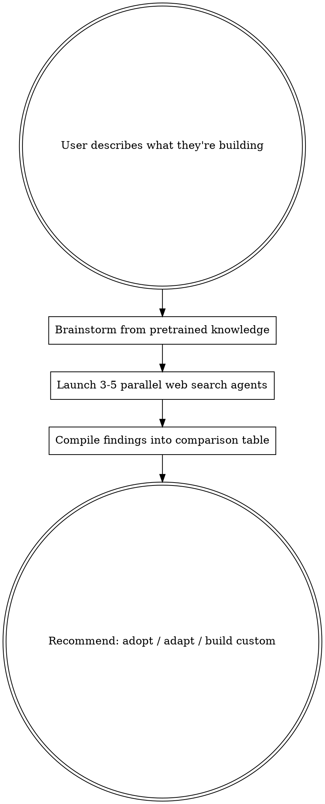

# Prior Art Discovery

## Overview

Before building anything custom, systematically discover what already exists. The cost of adopting an existing standard is almost always less than maintaining a custom one — and that's usually discovered too late, after the custom version is load-bearing.

## The XY Problem — Read This First

The user is often deep in the weeds solving problem Y (their attempted solution) when the real question is about problem X (the root need). They self-identify as prone to this. When they ask "is there a library for X?", first ask yourself: **is X the actual problem, or is it an approach they chose for a deeper problem?**

The user is often exploring domains new to them and may not know the vocabulary well enough to ask the right question. Don't automatically presume every question is an XY problem — but ask yourself whether it might be. Apply the **5 Whys** at multiple stages of your thinking:

1. **Before searching** — Why does the user need this? Why that approach? Is there a deeper need?
2. **After brainstorming** — Why are we building this specific thing? Is there a broader solution that dissolves the problem?
3. **After results come in** — Why didn't the user find this themselves? Is the domain vocabulary different from what they'd search for?

If the root problem IS different from the surface question, search for prior art on BOTH — but lead with the root-level answer.

Example: User asks "is there a library for fuzzy-matching product names?" — the root problem might be "I need canonical product identifiers." Prior art for the root problem is a barcode standard (GTIN/UPC): once every product has a canonical ID, most of the matching problem disappears. Prior art for the surface question is a fuzzy-matching library (e.g. a Levenshtein/Jaro-Winkler implementation). The root-level answer can save months of work. But sometimes the user really does just need fuzzy matching — don't be patronizing about it.

## When to Use

- About to create a custom ID scheme, taxonomy, or controlled vocabulary
- Building a data model for a well-studied domain
- Implementing an algorithm that sounds like a solved problem
- User says "what prior art exists", "is there a standard for this", "should I use an existing library"
- You notice yourself designing something that feels like it should already exist
- Starting work on a new domain you haven't researched yet

## Process

### Step 1: Brainstorm (you, no tools)

Before searching, dump what you already know. List:
- **Standards bodies** that operate in this space (ISO, W3C, IEEE, OASIS, IETF, or a body specific to the field)
- **Canonical identifiers** that might already cover this (e.g. DOI for documents, ISBN/ISSN for publications, UUID/ULID for opaque unique IDs, ISO 3166 for countries, ISO 4217 for currencies, GTIN/UPC for products)
- **Well-known libraries** in the user's language ecosystem
- **Established techniques** that solve this class of problem
- **Adjacent domains** that solved a similar problem (what did THEY use?)

Share this brainstorm with the user BEFORE launching searches — they may already know some of these and can steer the search.

### Step 2: Parallel Web Search (3-5 subagents)

Launch subagents simultaneously, each investigating a different angle:

1. **Standards agent** — Search for official standards, specifications, controlled vocabularies. Query: "[domain] standard identifier", "[domain] controlled vocabulary", "[domain] ontology"
2. **Libraries agent** — Search for packages/libraries in the relevant language ecosystem. Query: "python [domain] library", "npm [domain]", check package registries (PyPI, npm, crates.io) directly
3. **Prior-work agent** — Search for survey papers, comparison studies, write-ups of the tradeoffs. Query: "[domain] survey", "[domain] comparison of approaches", "[domain] best practices"
4. **Precedent agent** — Search for how established projects solved this. Query: "how does [well-known open-source project] handle [problem]", GitHub repos with >1K stars
5. **Data sources agent** — Search for freely available datasets, APIs, registries. Query: "[domain] API", "[domain] registry", "[domain] database free"

Each agent reports: name, coverage, ID format, API/data access, license, adoption level.

### Step 3: Compile Comparison Table

Present findings as:

| Option | Coverage | ID Format | Access | License | Adoption | Fits Our Needs? |
|--------|----------|-----------|--------|---------|----------|-----------------|
| Standard A | ... | ... | ... | ... | ... | ... |
| Library B | ... | ... | ... | ... | ... | ... |
| Build custom | Full | Our design | N/A | N/A | Just us | ... |

### Step 4: Recommend

One of three outcomes:

- **ADOPT** — An existing standard covers >80% of needs. Use it directly. Map your data to their IDs. Worth the upfront cost.
- **ADAPT** — An existing standard covers 50-80%. Use their IDs as the base, extend with a thin custom layer for the gaps. Document what's standard vs custom.
- **BUILD CUSTOM** — Nothing covers >50%, or the domain is genuinely novel. But document WHY existing options were rejected, so future work doesn't re-discover them from scratch.

## What to Search For (by problem type)

| Building... | Search for... |
|-------------|--------------|
| ID scheme / taxonomy | Controlled vocabularies, ontologies, thesauri, registries (e.g. ISO 3166 countries, ISO 4217 currencies, BCP 47 language tags, GTIN/UPC products) |
| Data model / schema | Existing schemas and vocabularies for the domain (e.g. schema.org, OpenAPI, JSON Schema, GraphQL SDL, an industry-specific data model) |
| Algorithm | Survey papers, textbook solutions, existing implementations on GitHub |
| File format | Existing specs (e.g. Dublin Core, RSS/Atom, EPUB, a domain-specific XML/JSON schema) |
| API design | REST conventions, GraphQL patterns, existing public APIs in the domain |
| Scoring / ranking | Established methodologies (e.g. graph-centrality ranking, Elo/Glicko rating systems, a domain-specific scoring framework) |
| Text extraction / classification | Pre-trained models, annotated corpora, shared tasks and benchmark leaderboards |

## Common Mistakes

| Mistake | Fix |
|---------|-----|
| Searching only in your language ecosystem | Standards are language-agnostic. A library in a different language might document the best approach even if you're not using that language. |
| Dismissing a standard because it's "too complex" | You can adopt the ID scheme without adopting the full standard. Partial adoption beats full reinvention. |
| Not checking if the standard has an API | Many standards and registries expose free lookup APIs. Don't scrape what you can query. |
| Assuming nothing exists because you haven't heard of it | The user hasn't heard of it either — that's why this skill exists. Search anyway. |
| Stopping at the first hit | Multiple competing standards is common. Compare before choosing. |
