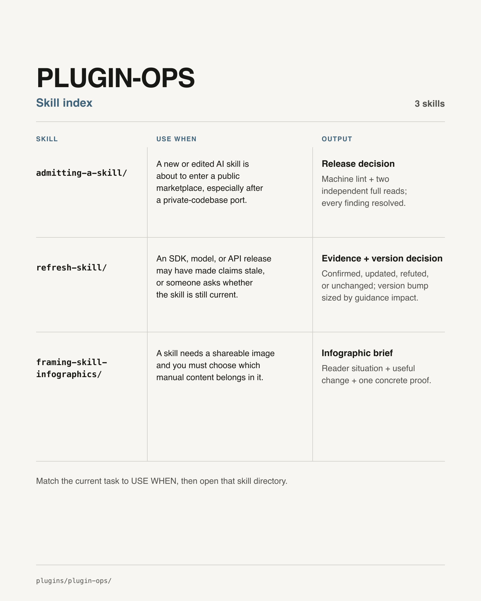

# PLUGIN-OPS

Skill index · 3 skills

| Skill | Use when | Output |
|---|---|---|
| [`admitting-a-skill/`](skills/admitting-a-skill/SKILL.md) | A new or edited AI skill is about to enter a public marketplace, especially after a private-codebase port. | Release decision from machine lint and two independent full reads, with every finding resolved. |
| [`refresh-skill/`](skills/refresh-skill/SKILL.md) | An SDK, model, or API release may have made claims stale, or someone asks whether the skill is still current. | Evidence status and version-impact decision. |
| [`framing-skill-infographics/`](skills/framing-skill-infographics/SKILL.md) | A skill needs a shareable image and you must choose which manual content belongs in it. | Infographic brief: reader situation, useful change, and one concrete proof. |
