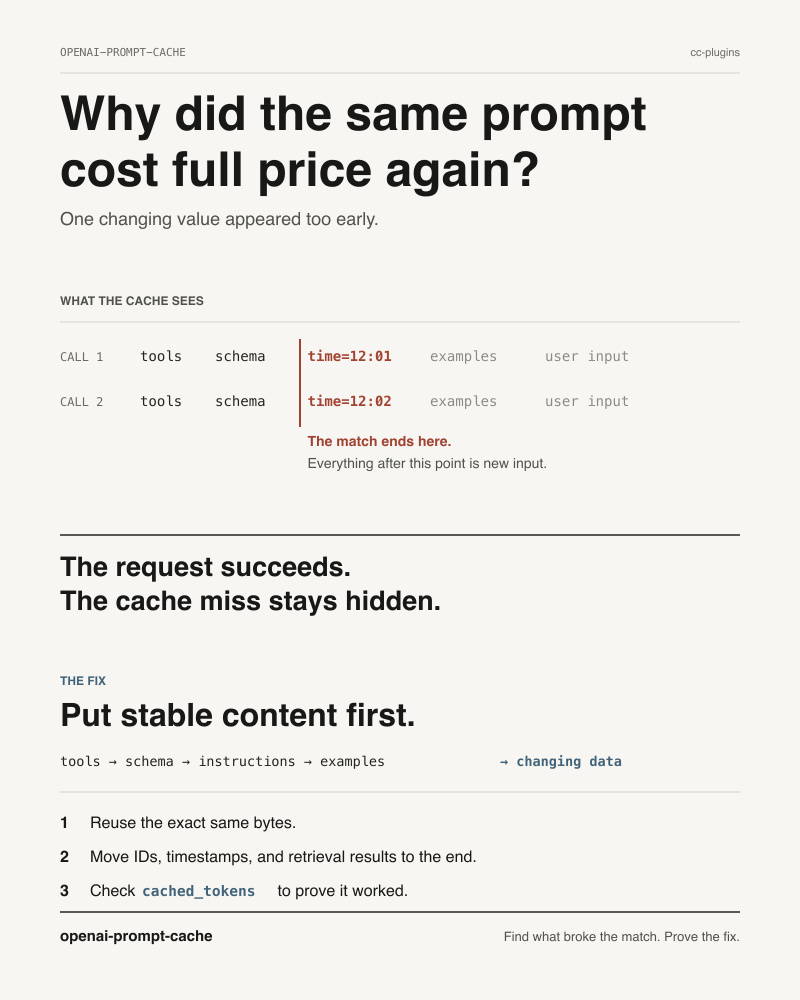

# OpenAI Prompt Cache Optimization



## Overview

OpenAI's prompt cache discounts repeated input tokens **50–90%** (varies by model family) and cuts first-token latency **up to 80%** on long prompts. The cache is a **prefix cache** — it matches the longest exact byte-prefix of your request against an inference engine's KV state. Anything that perturbs those bytes causes a full miss.

The skill is the discipline of:
1. Getting stable content above the **1,024-token minimum**
2. Putting it at the **head of the rendered prefix**, byte-stable
3. Putting all dynamic content in the **tail**
4. **Measuring** `cached_tokens` to verify

## When to use

- Designing a prompt that will be called repeatedly (>10×/hour, or any reused-system-prompt pattern)
- Cost has spiked unexpectedly on a workload that should be cache-friendly
- First-token latency is high on calls that share most of their input
- Migrating from Chat Completions → Responses API (cache semantics shift)
- Adding/changing a `response_format` JSON schema or Lark grammar
- Auditing a tool-using agent loop where every turn re-sends large state

## When NOT to use

- One-shot prompts under 1,024 tokens (cache literally cannot hit)
- Prompts where every byte legitimately varies per call (no shared prefix to optimize)
- Prototypes / exploratory eval where total cost and latency don't matter

## Universal laws (apply regardless of API surface)

| Property | Value |
|---|---|
| Minimum cacheable prefix | **1,024 tokens** |
| Cache-hit quantization | **128-token boundaries** beyond the floor |
| Routing hash window | First **~256 tokens** (varies by model) + `prompt_cache_key` |
| Default retention | **`24h` by default** on GPT-5-series non-ZDR orgs (since **2026-05-29**); the older `in_memory` policy = 5–10 min idle, 1 hr hard cap |
| `in_memory` removal | gpt-5.5 / gpt-5.5-pro and **all future models** support **only `24h`**; ZDR orgs default to `in_memory` but `24h` is **permitted under ZDR** (stores KV tensors, not content) |
| Throughput per (prefix, key) bucket | **~15 RPM** before overflow to cold engines (OpenAI cookbook) |
| Isolation | **Per-org** (documented: "not shared between organizations"); per-model-snapshot / per-region are community-inferred |
| Cache discount | **50%** (gpt-4o, o1), **75%** (o-series, gpt-4.1), **90%** (gpt-5.x); up to **98.75%** (gpt-realtime audio) |

## The optimization workflow

1. **AUDIT.** Identify your stable content. Is it ≥ 1,024 tokens? If no, pad deliberately or accept zero cache.

2. **STRUCTURE.** Order content so dynamic stuff lands at the tail. Wire prefix sequence is forced:
   ```
   tools → response_format / text.format → developer/system → few-shots → user input
   ```

3. **STABILIZE.** Make the prefix byte-identical across calls.
   - Tool definitions: `json.dumps(..., sort_keys=True)`, snapshot at startup, never re-generate per call
   - JSON schemas: snapshot serialized bytes to disk, fail CI on drift
   - Lark grammars: snapshot the `definition` string, hash-log per call
   - RAG chunks: sort by stable doc id BEFORE splicing
   - Few-shots: fixed order, no shuffling

4. **ROUTE.** Set `prompt_cache_key` per logical workload to pin requests to the same engine. Shard the key (e.g. `f"workflow-v3-shard-{i%N}"`) to keep each (prefix, key) bucket under ~15 RPM.

5. **EXTEND.** GPT-5-series non-ZDR orgs already **default to `24h`** retention (since 2026-05-29), so low-cadence workloads cache across gaps with no action. Pre-gpt-5 / `in_memory` defaults still evict in 5–10 min — set `prompt_cache_retention="24h"` there. `24h` is **allowed under ZDR** (and forced on gpt-5.5+).

6. **MEASURE.** Read `cached_tokens` after every call. Field path differs by surface (see `references/by-surface.md`).

## Quick reference: API surface differences

| Surface | Cache-hit field | Notable quirk |
|---|---|---|
| Chat Completions | `usage.prompt_tokens_details.cached_tokens` | Wire prefix order forced (tools → schema → messages) |
| Responses | `usage.input_tokens_details.cached_tokens` | `instructions` parameter does NOT reliably cache — use `developer` role item in `input` instead |
| JSON Schema | (same as host API) | Schema is in cached prefix; separate ~120s schema-compile cache also exists |
| Lark grammar | (same as host API) | Grammar is in cached prefix; ~10× decode-latency overhead with CFG enabled |

## Common mistakes (highest-impact first)

| Mistake | Fix |
|---|---|
| Timestamps in system prompt | Move to `metadata` (out-of-band, doesn't enter prefix) |
| Regenerating Pydantic schemas per call | Snapshot to disk; fail CI when bytes drift |
| Reordering RAG chunks per call | Sort by stable doc id before splicing |
| Tool JSON without `sort_keys=True` | Pin canonical serialization once at startup |
| Mutating `tools` array to gate availability | Use `tool_choice={"type":"allowed_tools",...}` |
| `instructions` parameter on Responses for system prompt | Use `developer` role item in `input` |
| Reading `prompt_tokens_details.cached_tokens` on Responses | Path is `input_tokens_details.cached_tokens` on Responses |
| Model alias (`gpt-5.1`) in production | Pin dated snapshot — alias rotations are different KV caches |
| Trusting cache on gpt-5-mini / `*-nano` / now gpt-5.4 / gpt-5.5 | gpt-5-mini **72–76% miss rate** ([DavidDev, thread 1368208](https://community.openai.com/t/possible-cache-issue-on-gpt-5-mini-and-gpt-5-nano/1368208)); gpt-5.4-nano **0% hit rate** ([thread 1379973](https://community.openai.com/t/switching-to-gpt5-4-nano-results-in-0-cache-hit-rate/1379973)). Still open & broadening as of **2026-06-27** (gpt-5.4/5.5 too; trailing content >~500 tokens zeroes cache — [thread 1384129](https://community.openai.com/t/prompt-cache-documented-byte-prefix-matching-does-not-occur-on-gpt-5-4-gpt-5-5-when-trailing-user-content-exceeds-500-tokens/1384129)). A Responses-API escape hatch is reported but uncorroborated. Fix is claimed only for **GPT-5.6** (preview, gated). For now use gpt-5.1 for cache-sensitive routing (6–19% miss) and instrument `cached_tokens`. |
| Sharding `prompt_cache_key` per model in multi-model workloads | Possibly use the SAME key across sibling models — but the only evidence is a **single unverified HN self-report** ([46070749](https://news.ycombinator.com/item?id=46070749), Nov 2025, 0 comments, Chat-Completions test) claiming prefix-processing cache is shared across gpt-4o-mini/5-mini/5. Not corroborated; measure `cached_tokens` before relying on it. |
| Dynamic `Field(description=f"As of {today}...")` | Strip dynamic content from descriptions; move to user message |

## Companion considerations

**Static reminder at the cache tail (the Pareto move).** Place a short, **static** reminder block as the LAST item before the user message. Because it's static, it caches (~90% discount). Because it's at the tail of the prefix, it captures recency-bias attention boost — Anthropic measured up to 30% adherence improvement from query-at-end on multi-doc inputs; "Drift No More?" (arXiv 2510.07777, Oct 2025) measured 16–27% LLM-judge improvement from goal reminders. Zero per-call cost beyond the one-time cache write. **Anti-pattern:** dynamic reminders that interpolate per-call values (timestamps, IDs) — they break the cache from that point down. See `references/architecture-patterns.md`.

**Cost vs. cache tradeoffs.** A larger schema/grammar costs more per miss but more saved per hit. If hit rate is uncertain, smaller schemas amortize faster. See `references/by-surface.md` for the schema-vs-grammar decision criteria.

## Validation: confirm the cache is hitting

```python
# Chat Completions
resp = client.chat.completions.create(...)
print(resp.usage.prompt_tokens_details.cached_tokens, "/", resp.usage.prompt_tokens)

# Responses API
resp = client.responses.create(...)
print(resp.usage.input_tokens_details.cached_tokens, "/", resp.usage.input_tokens)
```

A new prefix takes **2–10 calls and 17–450 sec** to reach steady-state hits (community-measured) — single-call repros are noise. Run 20+ identical-prefix calls before concluding cache is broken.

## Deep reference

- `references/mechanics.md` — how the cache actually works (routing, hashing, TTL, eviction)
- `references/footguns.md` — exhaustive catalog of cache killers
- `references/by-surface.md` — Chat Completions, Responses, JSON Schema, Lark grammar specifics
- `references/architecture-patterns.md` — structured-vs-unstructured tradeoffs, long-conversation vs [stable prefix + variable tail], multi-model with shared schema
